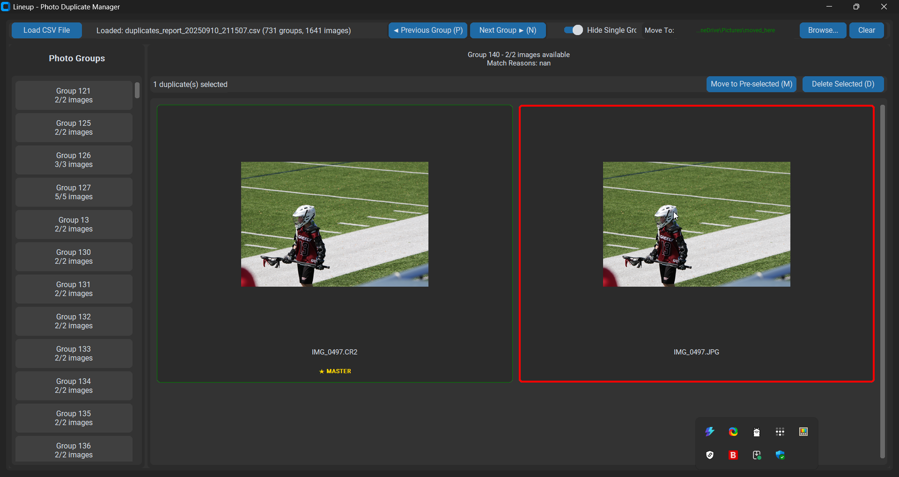
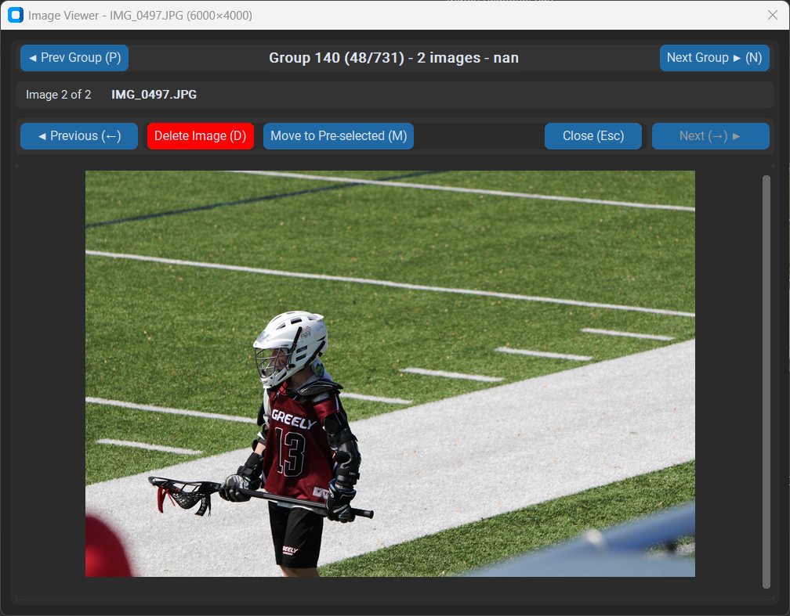

# Lineup - Photo Duplicate Manager

A cross-platform, intuitive, python-based desktop application with GUI for identifying and handling duplicate or similar images based on output from preprocessing a directory using [photochomper](https://github.com/johnzastrow/photochomper).

(Note: This is not a duplicate finder - it requires pre-generated CSV data from photochomper or similar tool.)

[]


## ✨ Key Features

### **Smart Image Management**
- **CSV Data Import**: Load photo groupings from CSV files from [photochomper](https://github.com/johnzastrow/photochomper)
- **CSV Reload**: Refresh data from the currently loaded CSV file with state preservation
- **Dynamic Thumbnails**: Adaptive thumbnail sizing that maximizes screen usage (200-400px)
- **Visual Group Navigation**: Color-coded group selection with live image counts
- **Master Image Highlighting**: Clear ★ MASTER (recommended image to keep) indicators
- **Smart Filtering**: Hide single-image groups and auto-select duplicates options 

### **Advanced Viewing & Navigation**
- **Full-Size Image Viewer**: Double-click thumbnails for detailed viewing
- **Cross-Group Navigation**: Previous/Next group buttons in image viewer
- **Comprehensive Keyboard Shortcuts**: 
  - ←/→ arrows for image navigation, Esc to close viewer
  - D for Delete, M for Move, N for Next Group, P for Previous Group
- **Smart Image Scaling**: Maintains aspect ratio while fitting window size
- **Group Information Display**: Shows current position, match reasons, and statistics
- **Auto-Advance Workflow**: Automatically moves to next group after operations for efficiency

### **Efficient Batch Operations**
- **Intelligent Selection**: Click to select images with smart selection logic
- **Auto-Selection**: Automatically select non-master images for quick processing
- **Global Move Directory**: Set once, use everywhere with visual confirmation
- **Smart File Operations**: Automatic conflict resolution with sequential naming
- **Operation Status**: Real-time feedback with color-coded messages and auto-clear timers
- **Auto-Refresh**: Instant UI updates and data validation after move/delete operations

### **Professional Interface**
- **Dark Mode Support**: System-aware theme switching with manual toggle
- **Comprehensive Toolbar**: Load CSV, Reload, Move To directory, and configuration controls
- **Responsive Layout**: Adapts to different screen sizes and window configurations
- **Visual Feedback**: Color-coded borders (green=unselected, red=selected, blue=selected group)
- **Status Indicators**: Clear operation progress and results with temporary display
- **Text Wrapping**: Full filename display without truncation
- **Filter Controls**: Toggle switches for hiding single groups and auto-selecting duplicates

### **Comprehensive Logging**
- **Multi-Level Logging**: Debug, Info, and Error levels with separate files
- **Structured Format**: Includes timestamps, function names, and line numbers
- **Performance Tracking**: Monitor load times and operation efficiency
- **Audit Trail**: Complete record of user actions and file operations

## Screenshots





## Requirements

- Python 3.13+ (recommended)
- customtkinter >= 5.2.0
- pillow >= 10.0.0  
- pandas >= 2.0.0
- pillow-heif >= 0.10.0 (for HEIC/HEIF support)
- uv (for dependency management, optional but recommended)
- (Optional) photochomper for generating CSV files
-  Windows, macOS, or Linux OS
  
  
## Installation and Quick Start

This app was built and tested using Python 3.13 and using the `uv` tool from Astral for dependency management.

**1. Clone the repository:**
```bash
git clone <repository-url>
cd lineup
```

**2. Install dependencies using uv:**
```bash
uv sync
```

**3. Launch the application:**
```bash
uv run main.py
```
**Once in the UI, follow these steps:**

1. **Load your data**: Click "Load CSV File" and select your photo groupings file
   - Use "Reload" button to refresh data from the same CSV file

2. **Configure settings** (optional):
   - Toggle "Auto-select Duplicates" to automatically select non-master images
   - Toggle "Hide Single Groups" to focus on groups with multiple images
   - Toggle "Dark Mode" for your preferred theme

3. **Set up "Move to" directory** (optional): Click "Browse..." next to "Move To:" to pre-select a destination folder

4. **Navigate groups**: Click on any group in the left panel - selected groups show in blue
   - Use "Previous Group" and "Next Group" buttons or P/N keys for navigation

5. **Review images**: 
   - Thumbnails automatically size to use available screen space
   - Master images show with ★ MASTER 
   - Missing files display with ❌ indicators
   - Auto-selection highlights duplicates for quick processing

6. **Select and manage duplicates**:
   - Single-click images to select/deselect (red/orange borders)
   - Use "Delete Selected (D)" or "Move Selected (M)" buttons
   - Status messages show operation results with auto-clear

7. **Use the image viewer**:
   - Double-click any thumbnail for full-size viewing
   - Navigate with arrow keys or Previous/Next buttons
   - Jump between groups without closing the viewer
   - Delete or move images directly from the viewer

## 🎯 Pro Tips

- **Efficient workflow**: Enable "Auto-select Duplicates" and set a "Move To" directory for rapid processing
- **Keyboard shortcuts**: 
  - Image viewer: ←/→ for navigation, Esc to close
  - Main app: D=Delete, M=Move, P=Previous Group, N=Next Group
- **Smart processing**: The app auto-advances to the next group after operations for continuous workflow
- **Visual indicators**: 
  - Green borders = unselected images
  - Red/orange borders = selected images  
  - Blue group buttons = currently selected
  - ★ MASTER text = recommended keeper images
  - ❌ indicators = missing files
- **Reload functionality**: Use the "Reload" button to refresh data after external changes to files
- **Filter controls**: Hide single-image groups to focus on actual duplicates
- **Check logs**: View detailed activity in `logs/lineup_info.log` and debug info in `logs/lineup_debug.log`

## CSV Format

Your CSV file should contain these columns and you can generate it using the `--search` function in [photochomper](https://github.com/johnzastrow/photochomper) or create it manually:
- `GroupID`: Identifier grouping similar photos together
- `Master`: Boolean indicating the recommended image to keep
- `File`: Image filename
- `Path`: Full path to the image file
- `MatchReasons`: Description of why images are considered duplicates

Example CSV structure:
```csv
GroupID,Master,File,Path,MatchReasons
1,True,IMG_001.jpg,/path/to/IMG_001.jpg,Exact duplicate
1,False,IMG_001_copy.jpg,/path/to/IMG_001_copy.jpg,Visually similar, Same size, Same Date
```

A sample CSV file (`sample_data.csv`) is included for testing.


## 🛠️ Development

### **Architecture**

The application follows a clean, modular architecture:

- **`main.py`**: Main application with enhanced UI, logging, and global state management
- **`data_manager.py`**: CSV processing, validation, and group management
- **`image_manager.py`**: Image loading, caching, thumbnails, and full-size viewer

### **Technology Stack**

- **GUI Framework**: customtkinter (modern, themeable UI components)
- **Image Processing**: Pillow (thumbnail generation, format support)
- **Data Handling**: pandas (CSV parsing, data manipulation)
- **Caching**: File-based thumbnail cache with metadata
- **Logging**: Multi-level structured logging system

### **Key Features Implementation**

- **Dynamic Layout**: Responsive grid system with optimal thumbnail sizing
- **State Management**: Global directory sharing between main app and image viewer
- **Visual Feedback**: Real-time UI updates with color-coded status indicators
- **Performance**: Asynchronous thumbnail loading with progress callbacks
- **Error Handling**: Comprehensive exception handling with user-friendly messages

### **File Structure**
```
lineup/
├── main.py              # Main application and UI logic
├── data_manager.py      # CSV data processing
├── image_manager.py     # Image handling and viewer
├── logs/               # Application logs
│   ├── lineup_debug.log # Detailed debug information
│   └── lineup_info.log  # User actions and events
├── .image_cache/       # Thumbnail cache
├── sample_data.csv     # Sample data for testing
└── CLAUDE.md          # Development guidelines
```

### **Development Commands**

```bash
# Run the application
uv run main.py

# Install/update dependencies  
uv sync

# View logs
tail -f logs/lineup_info.log
```

## License

See LICENSE file for details.
